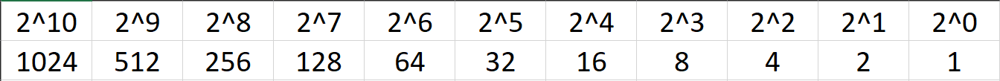

# Number Systems
> Other subjects and chapters are taught better than this one. I hope you can forgive me for such a bad first impression.

#### Base 10:
We mortal humans use the **decimal (base 10)** system.  
Base 10 includes 0, 1, 2, 3, 4, 5, 6, 7, 8, 9.  
Here is 243 in base 10:  
243 = (102 * 2) + (101 * 4) + (100 * 3) = 200 + 40 + 3.
#### Base 7:
We can apply this to any base. For example, 243 in base 7:  
243(in base 7) = (72 * 2) + (71 * 4) + (70 * 3) = 98 + 28 + 3 = 129(in decimal).

Base 7 includes 0, 1, 2, 3, 4, 5, 6.  
9 isn't in base 7, so how to we represent it in base 7?  
9(in decimal) = (71 * **<u>1</u>**</u>) + (70 * **<u>2</u>**</u>) = 7 + 2. Our answer is going to be 12(base7) = 9(base10).

## Base2/Binary:
What about base 2? Base 2 includes 0 and 1. It will help to break the base down:  
210 = 1024, 29 = 512, 28 = 256, 27 = 128, etc.

  

If you want to learn binary conversion and how to evaluate different bases, go here:

https://www.khanacademy.org/math/algebra-home/alg-intro-to-algebra/algebra-alternate-number-bases/v/number-systems-introduction

Trying to explain this stuff through words can be a little difficult, and that video describes it very well. It also saves me some time.

## Hexadecimal:
Hexa = 6, Dec = 10. **Hexadecimal is base 16**.  
Hexadecimal is very similar but can be a little confusing for some people. You see, we only have ten different individual numbers (0, 1, 2, 3, 4, 5, 6, 7, 8, 9). Hexadecimal needs 16 different numbers. You could use 0, 1... 11, 12, 13... but that would be extremely confusing. For example, what is 1432? Is that 1,4,3,2 or 14,3,2? When we need to represent anything above 9 we can instead use letters such as A, B, C, D... 

Learn hexadecimal here:

https://www.khanacademy.org/math/algebra-home/alg-intro-to-algebra/algebra-alternate-number-bases/v/hexadecimal-number-system

## Prefixes and Suffixes:
In order to distinguish between different number systems, we use prefixes or suffixes. There are many things used to distinguish between the number systems, I will only show the most common.  
* Decimal is represented with a **suffix "d"** or with nothing. Examples: 12d or 12. 
* Hexadecimal is represented with a **prefix "0x"** or **suffix "h"**. Examples: 0x12 or 12h. Another way hexadecimal is represented is with the prefix of "\x". However, this is typically used per-byte. Two hexadecimal digits make one byte. Examples: \x12 or \x12\x45\x21. If bits and bytes seem a little weird we'll get into them soon so don't worry.
* Binary is represented with a **suffix "b"** or with a **padding of zeros at the start**. Examples: 100101b or 00100101. The padding at the start is often used because a decimal number can't start with a zero.