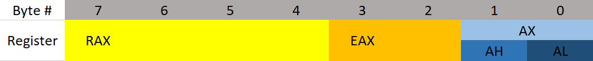

# Registers
Depending on whether you are working with 64 bit or 32 bit assembly things may be a little different. I'm going to focus on 64 bit Windows because it's the most popular. There are also two different syntaxes for x64 assembly: Intel and AT&T. AT&T is typically used on *NIX however the two are functionally the same, so you can translate between the two. We will focus on Intel because I think it's the easiest to read and it's the default for Windows. 
> If you have previous experience with x32 but not x64 you may be confused that the registers start with an "R" instead of an "E". I will address this.


### What Is Assembly?
When you compile a program, the compiler does various things. The most important thing is that it translates the high level code into a language that the CPU can understand. Assembly is the language the CPU executes. The CPU supports various instructions that all work together doing things such as moving data, performing comparisons, doing things based on comparisons, modifying values, and really anything else that you can think of.

### Assembly VS C:
This may get really confusing real fast for some people. What you need to remember is that Assembly was written for humans. It's just like higher level languages except less wordy. For example:  
```c
if(x == 4){
    func1();
}else{
    return;
}
```
is the same as
```assembly
mov RAX, x
cmp RAX, 4
jne 5       ; Line 5 (ret)
call func1
ret
```
That may look a bit confusing at first, but very soon it will make sense! I encourage you to try to figure out parts of it if you can.

### The Registers
Let's talk about **General Purpose Registers (GPR)**. You can think of these as variables because that's essentially what they are. Your CPU has it's own data storage that is extremely fast. This is helpful, however it's small in size. Anything data the CPU can't store on it's own is stored in memory. Memory (RAM) is much slower for the CPU to use. Because of all of that, the CPU uses general purpose registers as variables to hold data.

#### There are 8 main general purpose registers:
* RAX - Known as the **accumulator register**. Often used to store the return value of a function.
* RBX - Sometimes known as the **base register**. Sometimes used as a base pointer for memory access.
* RDX - Sometimes known as the **data register**. 
* RCX - Sometimes known as the **counter register**. Used as a loop counter.
* RSI - Known as the **source index**. Used as the source pointer in string operations.
* RDI - Known as the **destination index**. Used as the destination pointer in string operations.
* RSP - The **stack pointer**. Holds the address of the top of the stack.
* RBP - The **base pointer**. Holds the address of the base (bottom) of the stack.

All of these registers are used for holding data. Something I want to point out immediately is that these registers can be used for anything. It's just common practice to use them for certain things. For example, RAX is often used to hold the return value of a function. It doesn't have to, but imagine you were writing a program in Assembly. It would be extremely helpful to know where the return value of a function went, otherwise why call the function? Also, look at the Assembly example I gave. It uses RAX to store the *x* variable.

I should also note that while you can use these registers for anything, ESP and EBP should often only be used for what they were designed for. They store the location of the current stack frame (we'll get into the stack soon) which is very important. You can use ESP and EBP to store normal data, but you'll want to save their previous values and use them for only a few instructions because something else is probably going to use them soon.

#### The Instruction Pointer
RIP is probably the most important register. It is the address of the *next* line of code to be executed. This register is read only.

#### Register Break Downs
Each register can actually broken down into smaller registers. RAX is 64 bits, the lower 32 bits are referenced as EAX, the lower 16 bits are referenced as AX. AX is broken down into two 8 bit portions. One high and one low. The higher portion is referenced as AH, and the lower portion AL. This can be seen better in the diagram below:
<p align="center">
  
</p>
If I put 12345678 into RAX, then RAX refers to 12345678, EAX refers to 5678, AX refers to 78, AH refers to 7, AL refers to 8.

What is the "E" and the "R" for? The "E" stands for extended. The "R" stands for register. When looking at x32 assembly you will see EAX instead of RAX (RAX doesn't exist on x32).

> To see how all registers are broken apart go here:  
> https://docs.microsoft.com/en-us/windows-hardware/drivers/debugger/x64-architecture

### Extra Registers
There are additional registers that don't have a common use besides data storage. These registers are r0 to r15. There are also registers used for handling floating point values. These registers are XMM0 to XMM15.
