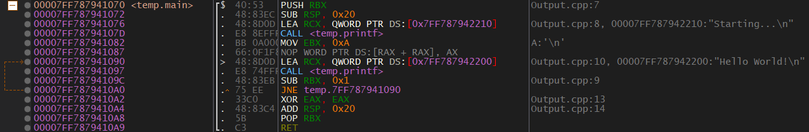

# Tool Types

## Debugger
You've probably heard of a debugger before. It allows a program to step through their code and analyze what it's doing line-by-line. We will be using these ourselves. Unfortunately for us, we won't have the source code, instead we will be looking at Assembly.

A crash course on debugging can be found in [0x302-Debugging](0x302-Debugging.md).

Both Visual Studio and x64dbg have debuggers built into them.

## Disassembler
A disassembler will take a binary and present it's Assembly code. Disassemblers are the backbone of reverse engineering. Here is the disassembly of a small function:

  

Ghidra and x64dbg can disassemble a program. Visual Studio also allows you to see the disassembled version of your code. This can be extremely helpful for learning or testing. If you want to enable this you can do so by setting a breakpoint in the program then going to Debug > Windows > Disassembly.  
You can view the memory by going to Debug > Windows > Memory > Memory #

## Decompiler  
A decompiler attempts to take a compiled program and turn it back into the original source code. These are often inaccurate but they are useful for identifying parameters, loops, conditionals, and sometimes structures. They can also be a good source to *help* identify data types (never trust decompiler data types, only use them as additional help).

Here is the decompiled version of the function shown in the disassembler portion:

  

Ghidra and x64dbg both have decompiler. Ghidra has one built-in and x64dbg has a plugin called "Snowman" that does it.

## Viewers
There are different ways to represent a program or parts of a program. Hex viewers and editors will show you the program represented in hexadecimal. There are even programs that will try to view the program as ASCII.

# Utilities
There are various other tools that we can use to gather more information about a binary. For example, DUMPBIN can be used to look at imports, exports, headers, symbols, and more.

The best way to figure out all of these tools is to use them.

# Static vs Dynamic Analysis
* Static Analysis - Analyzing at a binary when it's not running. In other words, viewing the binary as it is on disk. I also consider reversing a DLL in x64dbg using DLLLoader to be static analysis. This is because we can't step through the exported functions (they are never called).
* Dynamic Analysis - Analyzing the binary as it's running in memory.