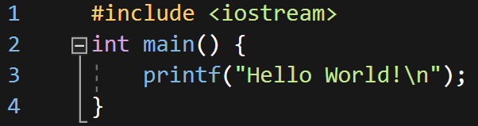
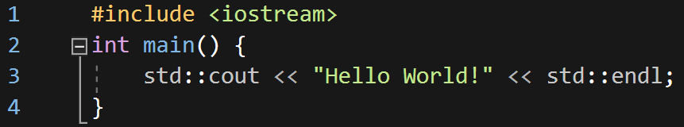
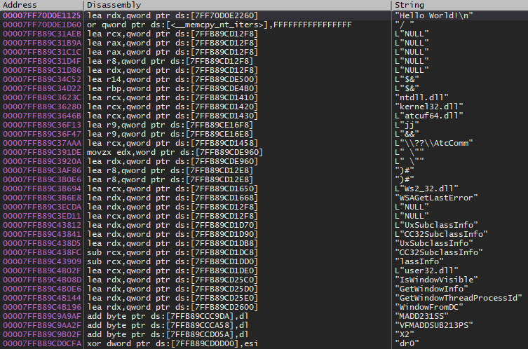
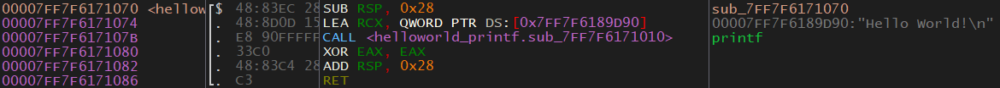
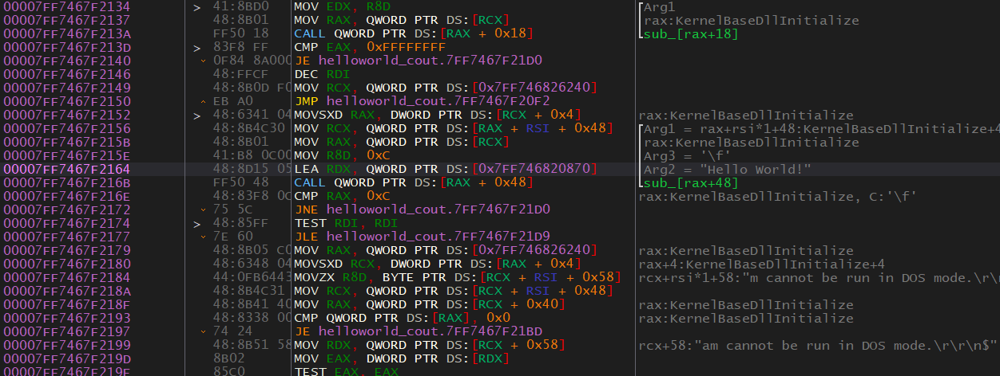

# Hello World
A "Hello World" program isn't going to be much different than the one covered in [0x402-FunctionCall](0x402-FunctionCall.md). There are many ways to make program print "Hello World!" in C++, I will be showing the two main ways. One with `printf()` and another with `std::cout`. It sounds simple, but we will cover some very important concepts.

## Source Code
#### Using `printf()`:
<p>
  
</p>

#### Using `std::cout`:
<p>
  
</p>

## Reversing the `printf()` Version
Let's view the compiled version of the programs in a disassembler. **We'll start with the `printf()` version.**  
I'll be using x64dbg for these programs because it does a good job at representing them. To disassemble a program in x64dbg you can go to File > Open then select the program. You can also just drag and drop the program onto the GUI of x64dbg.

When you first throw the binary into x64dbg you may notice that we aren't in the `main()` function. It turns out there are many things added to our program when it's compiled. Depending on how you have x64dbg setup it may start somewhere different. It might start at the "entry point" or near some security cookie stuff. 
* **Entry Point** - The entry point is the true beginning of the program. The entry point is ran *before* `main()`. The reason why `main()` isn't called first is because there are other tasks that need to be done before `main()` is called (such as setting up security cookies). 
* **Security Cookies** - The security cookie is used to make sure that the return address of a function hasn't been corrupted before following it. This is done to help mitigate buffer overflows. For us, we can ignore anything to do with security cookies.

#### Finding `main()`
We want to find the `main()` function because that's where the code we want to reverse is at. So how do we get there? The easiest way is by going to the symbol. Symbols are just names that the disassembler was able to find. These names are typically function names. Go the "Symbols" tab and click on the executable. 
<p align="center">
  
</p>

There doesn't appear to be a `main()` function so we will have to find it some other way. One option we have is looking for the string that is going to be printed. We know that our program is going to print "Hello World!" so let's see if we can find where that string is used. We can do this in x64dbg by right-clicking in the disassembly window and going to Search for > All modules > String references. You should see something similar to what is shown in the image below.

<p align="center">
  
</p>

As you can see there are quite a few strings. Most of these strings aren't important. Let's search for our "Hello World!" string using the search bar at the bottom. Go ahead and double click on the "Hello World!" string. If there are more than one just choose the first one. This will bring you into the function where the string is used.

<p align="center">
  
</p>

> Quick Tip: If you expand the address column you can see the function name. Functions are also marked with a dollar sign ("$") at the start of them.

The function this string is used in is `sub_7FF7F6171070`. This is probably different for you. You can see this next to the address (you might have to resize the column). The name is weird because the disassembler couldn't figure out its name so it just gave it a random name. So how do we know that this is the `main()` function? We don't. That's why reversing can be so difficult. Because we know what the code does and we have access to the source code we know that this is most likely the main function. In a realistic scenario, we wouldn't actually know for sure.

Just so we don't have to keep doing this let's change its label to `main` by right-clicking the first instruction in the function (the one with the `sub_7FF7F6171070` next to it) and choose Label > Label current address. Now we can get back to it by going to the functions tab and searching for `main`. You can get to the functions tab by going to View > Functions or by clicking the "fx" button on the toolbar above the "Memory Map" tab. The toolbar also has the debug buttons (blue arrows).

#### Analyzing Main
Let's figure out what `main()` is doing by looking at it in Assembly.

<p align="center">
  
</p>

* `SUB RSP, 0x28` - On the first line we can see `RSP` is subtracted by 0x28. This is part of the function prologue. The function prologue sets up a function and you can usually ignore them.
* `LEA RCX, QWORD PTR DS:[0x7FF7F6189D90]` - `LEA` is short for **Load Effective Address** which will load an address into the destination operand. In this case, the address of our string is being put into RCX. Notice that the value is being put into RCX which is the first register used to pass parameters to functions. Sure enough, the next line is a function call. What is the `QWORD PTR` part? This is simply stating that the value is a QWORD (8 bytes) and it's a pointer. `DS` is short for data segment which can store data that doesn't fit in a register. You can ignore this and just know that it's some data from somewhere in memory. In our case, this address is the address of our string. If you want to view the string in memory you can do so by right-clicking the instruction and going to Follow in Dump > Constant: (Address).
* `CALL <helloworld_printf.sub_7FF7F6171010>` This will call the function at `sub_7FF7F6171010`. As we previously discovered, this function will receive one parameter which is the address of our string. Thanks to xAnalyzer a comment was added that this function is `printf()`. If xAnalyzer didn't figure this out then how would we know this was `printf()`? Typically I would use multiple tools and one of them would probably tell you. The next easiest way would be to debug the program and see what happens after the call. We would see that the call has something to do with the text being printed out on the screen. Finally, we could reverse the function and figure it out that way.

Now we get to the function epilogue which is the end of the function. This portion will clean everything up before returning execution back to where it was called from.

* `XOR EAX, EAX` - If you XOR something with itself it sets it to zero. In this case, EAX is being zeroed out. I'm not sure why it's zeroing EAX instead of RAX, maybe RAX was never needed and only EAX was. I could dig into this but there really isn't any need to. We can determine from this that the function is returning 0. Based on this we can guess that the function type is an integer. If we look at our source code this is correct. Also, this further solidifies our guess that this is the `main()` function because `main()` is usually an integer type in C/C++.
* `ADD RSP, 0x28` - This is setting the stack to what is was before the function call. Notice that this is opposite to the `SUB RSP, 0x28` at the start.
* `RET` - Returns execution to the caller. This is the end of the function.

I want to touch on the fact that we passed the *address* of the string to `printf()`. In C/C++ strings are just an array of characters. The end of a string is denoted by a null character/byte (0x00). This is known as the string/null terminator. This is important because something like `printf()` will use this to know where the end of the string is so it doesn't print past it. In C/C++ a string is just a character array with the last character being a null terminator.

> 0x00 is referred to by many names. Null byte, terminator, string terminator, null terminator, and more.

I hope that wasn't too difficult to follow and understand. Finding the `main()` function can be annoying and it certainly doesn't make a good impression for people who are just starting to learn reversing, but it's what we have to do. Feel free to explore a little bit!

## Reversing the `std::cout` Version
This is where things get interesting. `std::cout` is part of C++, whereas `printf()` is part of C. This means that the compiler has full control over `std::cout` but not as much control over `printf()`. Think about how you would make a program that just prints text to the screen *once* as efficient as possible. Think about this, what could you do instead of calling a function just once? The answer is to not call any function, just put the text to be printed inside the print function or put the print function with the text to be printed. Sounds really fun for us reverse engineers doesn't it?!

Here is an example:

```c
int Add(int num1, int num2){
    return num1+num2;
}
int main(){
    int total = Add(2, 3);
}
```

How could we make this more efficient? There are two ways.  
The example below is more efficient because there are no parameters to be passed.

```c
int Add(){
    return 2+3;
}
int main(){
    int total = Add();
}
```

The example below is more efficient because there is no function call at all. Instead, the code for the `Add()` function has essentially been copied and pasted into `main()`. It may not seem like it because I have such a small example but that's exactly what has happened in the example. This is called (depending on who you ask) **function inlining, inline expansion, or just in inlining.** I'll just call it inlining.

```c
int main(){
    int total = 2 + 3;
}
```

### Reversing Time
Open HelloWorld_Cout.exe in x64dbg and let's get started. First, we want to find the main function. Let's use the same technique we used previously which was searching for the string.

<p align="center">
  
</p>

What is our string doing there? By looking at the code we can guess that the next function to be called is going to result in the string being printed. Also, note that the first parameter passed to the function is something to do with "KernelBaseDLLInitialize". This is an indicator that it's a function of a library, not a function implemented in HelloWorld_Cout.exe. If we are right, this could help us figure out what's going on.

Let's set a breakpoint on the LEA instruction that is dealing with our string. You can set a breakpoint by pressing F2 or by right-clicking and going to Breakpoint > Toggle. Then run the program until you hit that breakpoint. We can then step over the call by clicking the corresponding blue arrow at the top or by pressing F8. When we jump over this call we can see that the string appears in the console. It's extremely likely at this point that we are correct that this is `std::cout` or something to do with it. But how do we know that the function that was just called doesn't do something else? You can investigate the function that printed the text into the terminal. The function is accessed via an offset from RAX. This offset is 0x48. Because this function isn't be called with an address, we will need to know what RAX is and calculate the offset if we want to find the function. So we will have to run the function again until we reach that point. When execution has gotten to that line we can now see what RAX is. Now we go to RAX + 0x48 either by doing our own math or by pressing Enter and letting x64dbg figure it out then follow the call for us. From here you can reverse the function.

Another method to figure out what's going on is to write your own program that uses `std::cout` and see if things match. You could use the graph view to see the layout of the function in the program you're reversing and your own program to see if they match. You could, of course, look at the individual Assembly instructions but I think this is a little more tedious. This is a common technique that more experienced reverses use. Eventually, you will see patterns like this and be able to figure out pretty quickly what's going on.

### Getting To Main
So was the string put into `std::cout` or was `std::cout` put into `main()`? Figuring this out is pretty easy. First, go back to the instruction that referenced the string. We want to find out what called this function. Go to the first instruction in this function, this is also the functions address/location. Right-click it and select Find references to > Selected Address(es). We can see that this function is called once, go to where it is called form. This is where it was called from:

<p align="center">
  
</p>

This appears to be `main()` because of how small it is, but there are no guarantees. This is the function that causes our string to be printed so it's very likely that this is `main()` or something related to it.

So we now know that in this case, the compiler decided to put our string into `std::cout`.

What's with the second call? I encourage you to find out what this call is on your own. Here is a quick hint: the two functions called are very similar.  

<details>
  <summary>Answer (click to reveal):</summary>
  
  The second call is `std::endl`. You will see that the function prints "\n" which is the newline character.
</details>

## `std::cout` Used Twice
As I said, inlining is almost never used when a function is called more than once. So what does it look like if `std::cout` is used twice? Well, it look much more like the `printf()` version.

<p align="center">
  
</p>

As you can see there is one call for `std::cout` and one call for `std::endl` for each one of the two strings being printed, totaling in four function calls.

## More About Finding `main()`
There are a few techniques that you can use to find `main()`. In the future, I will talk about these methods. One thing I did want to mention is that `main()` should be called in the entry function. If you're looking for main, it's best to start from the bottom of the entry function and work your way up. That's it for now, I will add more about this topic in the future.  

Here is my quick blog post on finding `main()`: https://www.z0fsec.tk/2019/06/research-finding-main-function.html

## Final Notes  
The `printf()` version should be fairly easy to understand. The `std::cout` is much more confusing. Hopefully, you get the general idea of what's going on though. From this point, I would highly recommend that you write your own programs and see what's going on. Visual Studio allows you to view the Assembled version of your program along with the source code which can be great for learning. Don't worry if this bit was confusing, the `std::cout` thing is really weird and counter-intuitive.