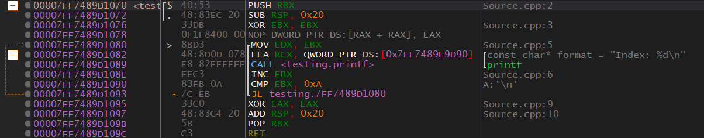

# 0x404 - Loops
Let's take a look at some loops. Loops are pretty simple, but they are easy to miss if you are just skimming over the disassembly. When reversing a binary you won't see keywords like "while" or "for" which are indicators of a loop. This is why they can be easy to miss.

## For Loop
<p align="center">
  
</p>

The quickest way to identify a loop is to find the index/iteration counter. In the example above we can see that EBX is being zeroed out with `XOR EBX, EBX`. This is nothing special, but if we go down a little we can see that EBX is being incremented with `INC EBX`. x64dbg also uses arrows (such as orange one on the far left) that hint at a possible loop. Alright, enough skimming, let's actually take a real look at the loop.

* First EBX is zeroed. We now know that this loop is going to start with a loop of zero. Let's refer to EBX as the loop index. 
* EDX is set to the loop index. 
* A string is moved into RCX. 
* `printf()` is called. RCX (the first parameter passed to `printf()` contains the string "Index: %d\n". EDX (the second parameter passed to `printf()`) contains the loop index. We can assume the `printf()` call looks something like:  
`printf("Index: %d\n", index);`
* The loop index is then incremented by one.
* The index is compared to 10 (0xA).
* If the index is less than 10, it will repeat the loop. The start of the loop is `MOV EDX, EBX`.

So this loop will print "Index: %d\n" 10 times. Here is what it looks like written in C/C++:
```c++
for (int i = 0; i < 10; i++) {
    printf("Index: %d\n", i);
}
```

## While Loops
Here is a program that is functionally the same as the previous one, except this one is a while loop.

<p align="center">
  
</p>

As you can see, the while loop is the same as the for loop.

## Do-While Loops
Do-while loops are not used very often by most developers, but compilers generate them constantly. Do-while loops are while loops except for the code inside of the while loop is run at least once. Most developers make loops that do exactly this even though they may not define them as such. Both the while loop and for loop examples given previously could be done with do-while loops. In an attempt to improve performance many compilers will use do-while loops instead of for loops or while loops. This is because they can eliminate one comparison and jump from the loop. If you ever use a decompiler you will mostly see them showing loops as do-while loops, this is why.

[<- Previous Lesson](0x403-HelloWorld.md)  
[Next Lesson ->](../0x500-DLL/0x500-DLL.md)  

[Chapter Home](0x400-ToolGuides.md)  
[Course Home](../README.md)  