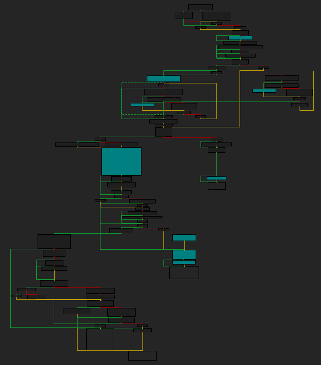
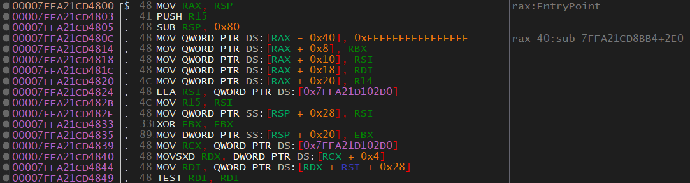

# 0x504 - Reversing and Calling `SayHello()`
The first thing I like to do is get a general idea of what the function is doing. The name of this function makes me think that it's going to "say" hello. This could be simply returning a string, or printing out "Hello". With this in mind, let's start.

This is the disassembly of `SayHello()`:
<p>
  
</p>

This function doesn't seem to return anything. It calls one function and jumps to another. The first function is `sub_7FFA21CD4800`. This function is pretty big.

If we skim through this function there are two things that jump out at me. We can see that inside the function, the string `"Hello!`" is used. This is good to know because this clearly relates to the name of the function.
<p>
  
</p>

Let's continue skimming through and see if we can find something else helpful. Something that jumps out to me is towards the bottom there are references to `ios_base`.
<p>
  
</p>

Seeing the string "`Hello!`" and `ios_base` in the same function makes me suspicious. I'm starting to think this is a system function, possibly `std::cout`. The reason is that `ios_base` is the base class of the I/O stream. Let's put the theory to the test, I'll write a quick program that uses `std::cout` and try to determine if the two are similar. The quickest way to do this is to view the graph view of the two programs.

DLL Graph View:
<p>
  
</p>

Test Program Graph View:
<p>
  
</p>

They are somewhat similar, but not similar enough. We'll have to dig into the assembly. Let's just take a look at the start of the functions:

DLL:
<p>
  
</p>

Test Program:
<p>
  
</p>

The start of the functions look almost exactly the same. At this point, we can be pretty confident that the function `SayHello()` is calling is `std::cout`. Let's take a look at the jump instruction at the end of the `SayHello()` function and see what we can find there. Here is the code that is jumped to:
<p>
  
</p>

My first guess, based on the fact that "\n" is used and that we think `std::cout` is called, is that this function is `std::endl`. Also, it does look like a more condensed version of `std::cout`.

In this case, I'm pretty certain that I've figured it out. You could do further reversing if you want.

# Implementing `SayHello()` In Our Own Program
So we've reversed the function, now let's use it. Before we use it we need to know what parameters the function takes, and it's data/return type. Looking at the function it doesn't seem to take any parameters. If it does take parameters it certainly doesn't use them. As for the return type, it doesn't seem to return anything either. So it seems like it takes no parameters and is of type void.  

<p>
  
</p>

> There is a version of this code you can copy/paste at the bottom of the section.

Don't worry if you don't fully understand the code. If you've never done anything like this, then that code may be pretty intimidating. I'll walk you through it.
* The code is using the Windows library (Windows.h).
* typedef is used to define the function as a data type which will make other tasks easier. I called the imported function "ISayHello". I prepended an "I" to the start of the function to indicate that it was imported. This is not required but I do it to make the code easier to use. Also, when we import the function from the library we will be able to import it as "SayHello" without having naming conflicts.
* Line 9 is where I import the DLL.
* The if-statement on line 11 is checking that the DLL was loaded.
* Line 14 is importing the `SayHello()` function. The function is given the name of "SayHello" when it's imported. This is why I use the "I" naming convention.
* Line 15 checks to make sure that the function was loaded successfully.
* Line 16 calls the function.

Before you run this code, there are two important things you need to do.
1. Compile the code in "Release" mode.
2. Put the DLL in the same location as the executable that we've written to run the DLL.
<p>
  
</p>

Awesome! As we can see, "Hello!" is printed out to the screen as we guessed it would be.

I don't know about you but I think it's really cool to see our code import and run a function from a DLL without us having any documentation, lib files, or header files.

# Copy/Paste Code

```c++
#include <iostream>
#include <Windows.h>

//void SayHello(); //Function declaration (for reference)
typedef void(WINAPI* ISayHello)(void); //Typedef the function for use.

int main()
{
	HMODULE dll = LoadLibraryA("DLL.DLL"); //Load our DLL.

	if (dll != NULL)
	{
		//Set SayHello to be the "SayHello()" function.
		ISayHello SayHello = (ISayHello)GetProcAddress(dll, "SayHello");
		if (SayHello != NULL) {
			SayHello();	//Call the function.
		}
		else {
			printf("Can't load the function.");
		}
	}
}
```

[<- Previous Lesson](0x503-Exports.md)  
[Next Lesson ->](0x505-PrintArray.md)  

[Chapter Home](0x500-DLL.md)  
[Course Home](../README.md)  