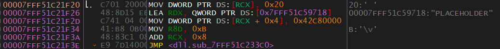
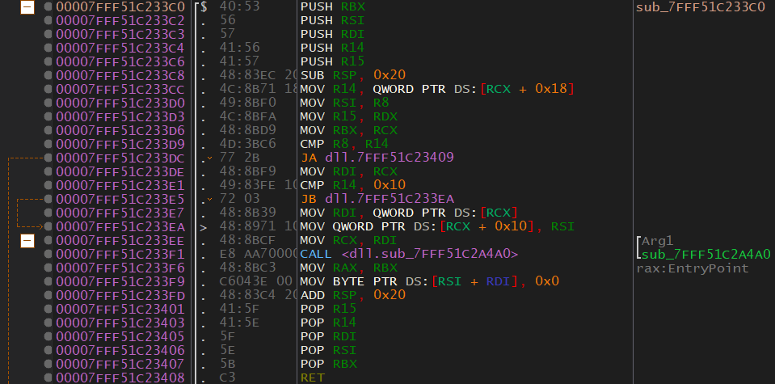
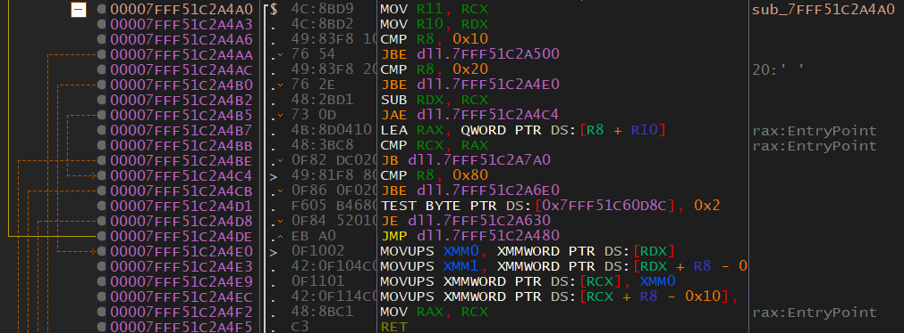

# 0x506 - Initialize Player
Typically a DLL will have a general purpose. It might be a DLL used for setting up a linked list, logging information, graphics, etc. The DLL we are reversing does more than just one general task. This is because I wanted to introduce you to DLL reversing with some easier examples. I'm going to let you know that the `InitializePlayer`, `PrintPlayerStats`, and  `MysteryFunc` functions are all related to each other. Again, this DLL is meant to be a learning tool. We will get into better examples later on.

With that said, let's get started.

It looks like there are two functions related to `Player`. `Player` is probably a structure (struct). To find out, we need to reverse the functions that use the `Player` struct and find out what it consists of. Let's start with `InitializePlayer` because it will most likely give us the most information. It should also let us know what the bare minimum is for a `Player` struct.

> Structs and classes are the same. The only difference is that one is private and one is public by default. Other than that, they both work exactly the same. It's fine to use class and strcut interchangeably when talking about C++. C doesn't have classes, so if you're talking about C use struct instead of class.

## Reversing
<p>
  
</p>

Thanks to x64dbg's analysis, we can see the function declaration:
* `void __cdecl InitializePlayer(class Player * __ptr64)`

So the function returns void and takes a pointer to a `Player` class. If you didn't know already, when referencing the first element in a class/struct you do so with the base of the class. You can think of it like this: 
* `Player` = First element. 
* `Player` + F = Second element (F is the size of the first element). 

Let's take a look at the Assembly code and figure out what's going on.

* `MOV DWORD PTR DS:[RCX], 0x20` - This moves 0x20 (32) into the first element of the `Player` class. We now know that the first element in a `Player` is, most likely, an integer.
* `LEA RDX, QWORD PTR DS:[0x7FFF44719718]` - This loads the address to the string "PLACEHOLDER" into RDX.
* `MOV DWORD PTR DS:[RCX + 0x4], 0x42C80000` - Moves 0x42C80000 into the second element in the `Player` object. That seems like a strange value. If you look at the value as a float it seems that it's 100. This is interesting considering that 100 is commonly used as a maximum health value. For now, we can assume 0x42C80000 is a float. To be sure, we would want to see if this value is ever handled with floating point registers (XMM#).
* ```asm
    MOV R8D, 0xB
    MOV RCX, 0x8
    JMP <dll.sub_7FFF51C233C0>
    ```
    This jump is going to the start of a function. It also seems like the appropriate registers are being set for a function call before the jump. This might be some form of pseudo-call. Also, take a look at R8D and the string that was put into RDX but never used. The string is 11 characters, and R8D contains 0xB (11). This is slightly suspicious.

## Code Jumped To

Take a look at the code being jumped to from `InitializeCalss`:

<p>
  
</p>

The jump is definitely acting like a call. The code that's called is using registers like a function call was made. As to why it chose `jmp` instead of `call`, it's probably for optimization.

Before we start reversing this, I want you to guess what's going on. The string is being passed, and possibly the string length is being passed. It could be a coincidence that 0xB is used, but what if it isn't? Let's keep going, but I want you to make a guess as to what's going on and see if the code matches up with your guess. 
* Pushes - There are several pushes which are done to preserve registers.
* `MOV R14, QWORD PTR DS:[RCX + 0x18]` - Copies some data that is offset 0x18 from the `Player` object. We don't know what Player+0x18 is right now. 
* Some other moving is done that is pretty self-explanatory.
* `CMP R8, R14` - Compare R8 (0xB) to R14 (RCX + 0x18)
    * `JA dll.7FFF51C23409` - JA (Jump if Above) is the same as JG (Jump if Greater) except it's used for unsigned. This jump is testing 0xB against whatever is at RCX + 0x18. You could debug a program that uses this DLL to find out what is at RCX + 0x18, but for now, let's just continue without knowing. If we take this jump, it goes to another function. Right now I want to focus on reversing this function, so let's see what happens if the jump *isn't* taken.
* `CMP R14, 0x10` - Compare R14 (RCX + 0x18) to 0x10 (16). Again, we don't know what's in RCX + 0x18.
    * `JB dll.7FFF51C233EA` - If RCX + 0x18 is below (less than) 16, then jump.
* `CALL <dll.sub_7FFF51C2A4A0>` - The instructions before this call are interesting. If the previous jump *isn't* taken, RCX will not be copied into RDI. RCX is the `Player` class. After the jump is taken, RSI (0xB) is put into RCX + 0x10. RDI (RCX from `InitializePlayer` which is `Player`) is moved into RCX.

Since the rest of the function doesn't seem to be very interesting, let's follow that call and see what it does. Here is the function:

<p>
  
</p>

* MOVs - RCX (`Player`) is moved into R11. RDX is still the string "PLACEHOLDER". RDX hasn't been modified since `InitializeClass`.
* CMP R8, 0x10 - Compares 0xB to 0x10.
  * `JBE dll.7FFF51C2A500` - If R8 is below or equal to 0x10 then jump. We know R8 is 0xB which is less than 0x10. So let's follow the jump.
* `MOV RAX, RCX` - Move the `Player` into RAX.
* `LEA R9, QWORD PTR DS:[0x7FFF51C20000]` - If you follow 0x7FFF51C20000 in the dump you'll see that this is the beginning of the binary. You can tell because of the "MZ" at the start. You can also tell because you can't scroll the dump up any further.
* `MOV ECX, DWORD PTR DS:[R9 + R8 * 4 + 0x45000]` - If you have some experience, you'll know what's going on. R9 is the base of the binary. R8 is the size of our string. 0x45000 is some offset, probably an offset into some data storage area.

  
## Back To `InitializeData`

Now we know what the `InitializeData` function does. It sets the first element to be 0x20 (32). The second element is a float of 100. The third element is a string of "PLACEHOLDER".

[<- Previous Lesson](0x505-PrintArray.md)  
[Next Lesson ->](0x507-PrintPlayerStats.md)  

[Chapter Home](0x500-DLL.md)  
[Course Home](../README.md)  