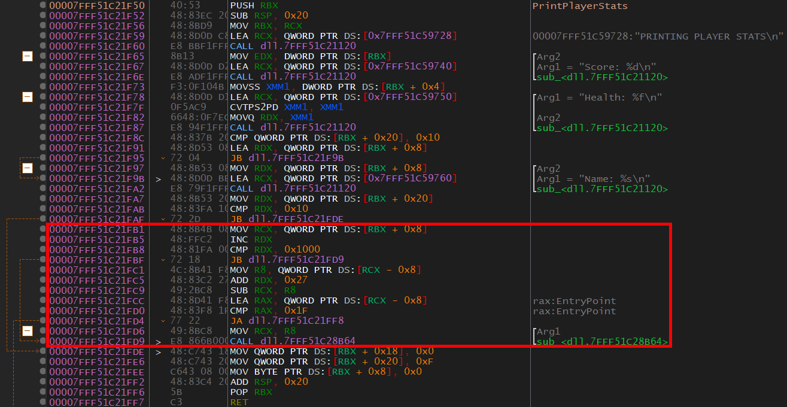

# 0x507 - PrintPlayerStats
Before we use `InitializePlayer` in our own program, let's see what other information we can find about the class. To find more information, let's look at `PrintPlayerStats`. 

  

This function is actually quite simple, all it does is print information about a `Player`. I want you to try to reverse this function on your own. I challenge you to figure out what the purpose is of each line of code.

I do want to let you know something before you start. There is some extra code after the final `printf()` call. If you do not follow the `JB` after the final `printf()` call, execution goes into some memory freeing code. Feel free to reverse this if you want, but you can ignore it.

Here is the code I'm talking about (in the red box):

  

Anyways, good luck and have fun! We'll be reversing one more thing and then we will implement this `Player` class in our own code.

[<- Previous Lesson](0x506-InitializePlayer.md)  
[Next Lesson ->](0x508-MysteryFunc.md)  

[Chapter Home](0x500-DLL.md)  
[Course Home](../README.md)  