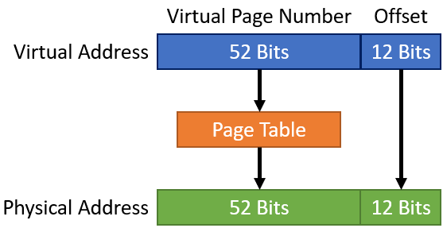
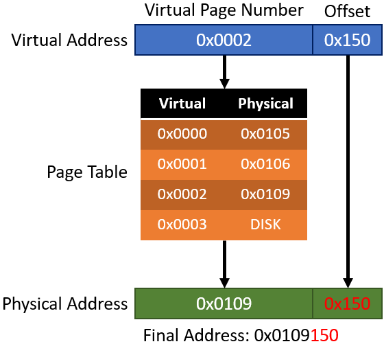

# Virtual Memory - Rough Draft
You're probably aware that a computer has physical memory, also known as RAM. But how is this memory accessed? Well, with addresses of course! Unfortunately it's not that simple. 
* If there are multiple processes running on the system, you now need some way to specify regions in memory for each process. 
* You also start to run into the issue of space. What do you do if you only have 4GB of physical memory but the processes running take up 6GB?
* If programs aren't loaded into the same address space every time they run, then hard-coded addresses won't work.
* What about fragmentation? If a small program exits and there isn't enough room for a new process, that's just wasted space. Even if a process is small enough to fit in that space unless it's the same exact size, there will still be unused memory.

To solve these issues, and many others, what if we could treat every process as if it was the only process on the system. This is where virtual memory comes in. 

For example, let's say every process thought it was at 0x10000000 in memory. Using a some tricks, when that program is loaded into memory, the OS could translate those addresses into physical memory. Let's say the program is actually loaded at 0xB0004500. If the program needs to access data that is at an offset of +0x40 it would do it via 0x10000040 (0x10000000 + 0x40). Whenever the process tries to access that data, the OS could translate that into 0xB0004540 (0xB0004500 + 0x40). By doing this the program could be loaded anywhere into memory and it could try to use memory as if it was the only process.

Another fancy thing about virtual memory is that it can map processes in chunks. For example, part of the process could be at 0xB0004500 to 0xB000F000 and another part could be at 0xD0100000 to 0xD010C000. Another process could be between those two chunks, such as from 0xC0000000 to 0xD0000000.

## Pages
The previous examples explained the idea of virtual memory. Now let's discuss how virtual memory actually works and how it's implemented.

Mapping every physical memory address to a virtual memory address individually would, ironically, take up too much memory. Instead, the physical memory in a computer is usually divided into 4KB chunks called ***pages***. The pages are mapped to physical memory instead of mapping each individual address. There are small and large pages that are 4KB and 2MB respectively. These pages and their information are stored in ***page tables***. Pages are quite complex, but for our purposes we only need a simple understanding of them.

>Large pages are typically used for core Windows components and I/O.

The mapping of these pages from physical addresses to virtual addresses is done by the Memory Management Unit (MMU). The MMU is a physical piece of hardware which, on conventional desktop computers, resides in the processor.

## Address Translation
Now for the fun part, how virtual addresses are actually mapped to physical addresses.

>This is a simplified version of what really happens, because going into the details is pointless for this course and it just adds more confusion.

Each table entry is broken into 2 parts. The bottom twelve bits are the page offset. The rest is the virtual page number or virtual address. The remaining 12 bits are not translated and instead are treated as an offset.

  

Here's an example (not fully accurate, just for easy explanation):

  

The virtual address is 0x0002150. 

* The address that will be looked up in the page table, aka the base address, is 0x0002. 
* The offset is 0x150.  This is not completely accurate to a real process (0x150 isn't 12 bits), this is just for demonstration.
* 0x0002 will be looked up in the page table and it will be translated into 0x0109.
* From 0x0109 the offset 0x150 will be added.
* The result is 0x0109150.

There it is, the basics of virtual memory. Hopefully it wasn't too painful.

### Other Explanations
Here are some other resources that deal with virtual memory:
* https://courses.cs.washington.edu/courses/cse378/09au/lectures/cse378au09-23.pdf
* https://www.youtube.com/playlist?list=PLiwt1iVUib9s2Uo5BeYmwkDFUh70fJPxX
* https://www.youtube.com/watch?v=2quKyPnUShQ
* https://www.bottomupcs.com/virtual_addresses.xhtml