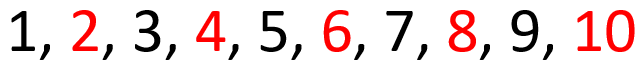

# 2.6 Mindset
Having the right mindset can be really helpful. Something to understand is that computers are extremely stupid. They operate with pure logic and they don't make any assumptions.

To demonstrate this, let's say you tell the computer to write the numbers 1-10 and make all of the even numbers red.  
This is what you might expect:

  

That looks correct, all even numbers are red just as expected.

The computer may also generate the following:

  

Once again, the list is valid and follows the rules. All even numbers are red.

Some people will get extremely confused by this because their brains will flip the rule and tell them that all red numbers are even, which is not true according to what we told the computer. Computers won't flip the rules or apply any sort of assumptions like a human might.

In fact, the rules don't dictate anything about the odd numbers, so they can be any color we want!

  

Where did the 9 go? The computer must have made an error and forgot to write the 9... or did it? Maybe the computer made the 9 white and it blends in with the background. This is completely valid because there is no rule against it.

### What is a Protocol?
TCP, UDP, HTTP(s), FTP, and SMTP are all protocols. Why? What are protocols? Protocols are simply templates that are used to specify what data is where. Let's use an example.
> 01011990JohnDoe/0/123MainSt

What is that? Without some sort of guide or template, that just seems like a mess of data. Because we're humans we can probably pick out some information such as a name and a street. But computers can't do that and we humans are still unable to understand all of it. It's actually a bunch of helpful data about someone named "John Doe". It's confusing because it's all packed together in an attempt to make it as small as possible. Here, let me give you the secret formula:
> BIRTHDAY(MMDDYYYY)NAME/NumOfChildren/HomeAddress

See, now it makes sense! The collection of numbers at the start is his birthday. Following his birthday is his name. There is then a forward slash and the number of children he has. Then another forward slash and his home address. Here is another example:
> 03141879AlbertEinstein/3/112MercerSt

This is a great demonstration of what a protocol is. It's simply a template that computers can use to pick apart a series of data that would otherwise seem pointless. 

I also want to point out the delimiters (the forward slashes) used for the number of children and the street they live on. Because those pieces of data have variable lengths, it's a good idea to distinguish between them in some way besides a specific number of characters. Remember, a computer can't make assumptions. We need to be very literal or it won't know what we mean. The rules for the protocol are as follows. Assuming the template is filled out correctly, the first 8 characters represent the birth date. The characters following the date up to the forward slash are the person's name. Then the next character(s) following that forward slash and up to the next forward slash is the number of children that person had. Finally, the rest of the data after the final forward slash is the persons home address.

### Is It Equal?
Because computers are stupid, they often do things in such a simple way that may not be obvious at first. For example, how does a computer decide if two values are equal? When you start looking at Assembly instructions there is a compare instruction. This instruction can decide if a value is greater than another, less than another, or equal to another. How does this instruction determine all of these things? It's actually quite simple, just subtract them. It's so simple it may not be obvious at first.

[<- Previous Lesson](2.5%20BitwiseOperations.md)  
[Next Lesson ->](../Chapter%203%20-%20Assembly/3.0%20Assembly.md)  

[Chapter Home](2.0%20BinaryBasics.md)  
