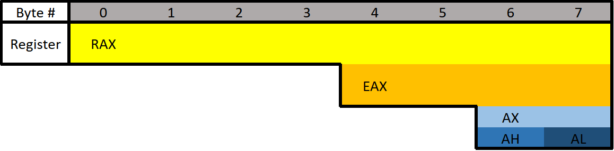

# 3.1 Registers
Depending on whether you are working with 64-bit or 32-bit assembly things may be a little different. As already mentioned this course focuses on 64-bit Windows. There are also two different syntaxes for x64 assembly: Intel and AT&T. AT&T is typically used on *NIX operating systems however the two are functionally the same, so you can translate between the two. We will focus on Intel because I think it's the easiest to read and it's the default for Windows. 
> If you have previous experience with x32 but not x64 you may be confused that the registers start with an "R" instead of an "E". We will talk about this.


### What Is Assembly?
When you compile a program, the compiler does various things. The end goal of a compiler is to translate high-level code into a language the CPU can understand. This language is Assembly. The CPU supports various instructions that all work together doing things such as moving data, performing comparisons, doing things based on comparisons, modifying values, and really anything else that you can think of. While we may not have the high-level source code for any program we do have the Assembly code. An executable is simply a list of Assembly instructions that can be executed.

### Assembly VS C:
This may get really confusing real fast for some people. What you need to remember is that Assembly was written for humans. It's just like higher level languages except less wordy. For example:  
```c
if(x == 4){
    func1();
}else{
    return;
}
```
is functionally the same as
```assembly
mov RAX, x
cmp RAX, 4
jne 5       ; Line 5 (ret)
call func1
ret
```
That may look a bit confusing at first, but very soon it will make sense! I encourage you to try to figure out parts of it if you can. In Assembly things are written in a shorter notation; MOV is short for "move". 

### The Registers
Let's talk about **General Purpose Registers (GPR)**. You can think of these as variables because that's essentially what they are. Your CPU has it's own data storage that is extremely fast. This is helpful, however, space in the CPU is extremely limited. Any data the CPU can't store on its own is stored in memory. Memory (RAM) is much slower for the CPU to use. Because of the slow speed, the CPU tries to put data in registers instead of memory if it can.

#### There are 8 main general purpose registers:
> Don't worry too much about how the following registers are used except for RSP and RBP. We'll cover RSP and RBP later too, so don't worry.

* RAX - Known as the **accumulator register**. Often used to store the return value of a function.
* RBX - Sometimes known as the **base register**. Sometimes used as a base pointer for memory access.
* RDX - Sometimes known as the **data register**. 
* RCX - Sometimes known as the **counter register**. Used as a loop counter.
* RSI - Known as the **source index**. Used as the source pointer in string operations.
* RDI - Known as the **destination index**. Used as the destination pointer in string operations.
* RSP - The **stack pointer**. Holds the address of the top of the stack.
* RBP - The **base pointer**. Holds the address of the base (bottom) of the stack.

All of these registers are used for holding data. Something I want to point out immediately is that these registers can be used for anything. Their "use" is just common practice. For example, RAX is often used to hold the return value of a function. It doesn't have to (and often doesn't), but imagine you were writing a program in Assembly. It would be extremely helpful to know where the return value of a function went, otherwise why call the function? Also, look at the Assembly example I gave earlier. It uses RAX to store the *x* variable.

I should also note that while you *can* use these registers for anything, there are some registers that are best left alone when dealing with typical data. For example, RSP and RBP should almost always only be used for what they were designed for. They store the location of the current stack frame (we'll get into the stack soon) which is very important. You can use RSP and RBP to store normal data, but you'll want to save their previous values so you can restore them to their original state when you are finished with them. 

#### The Instruction Pointer
RIP is probably the most important register. The RIP register is the "Instruction Pointer". It is the address of the *next* line of code to be executed. This register is read-only (kind of).

#### Register Break Downs
Each register can actually be broken down into smaller segments which can be referenced with other register names. RAX is 64 bits, the lower 32 bits can be referenced with EAX, and the lower 16 bits can be referenced with AX. AX is broken down into two 8 bit portions. The high/upper 8 bits of AX can be referenced with AH. The lower 8 bits can be referenced with AL.
<p align="center">
  
</p>

RAX consists of all 8 bytes which would be bytes 0-7. EAX consists of bytes 4-7, AX consists of bytes 6-7, AH consists of only byte 6, and AL consists of only byte 7 (the final byte).

If 0x0123456789ABCDEF was loaded into a 64 bit register such as RAX, then RAX refers to 0x0123456789ABCDEF, EAX refers to 0x89ABCDEF, AX refers to 0xCDEF, AH refers to 0xCD, AL refers to 0xEF. The 0x wouldn't actually be there, this is just used to denote that we're working with hexadecimal numbers.

What is the difference between "E" and "R"? The **"E" stands for extended**. The **"R" stands for register**. Remember, the "E registers" are 32-bit registers. When looking at x32 assembly you will see EAX instead of RAX (RAX doesn't exist on x32).

To see how all registers are broken apart go here:  
https://docs.microsoft.com/en-us/windows-hardware/drivers/debugger/x64-architecture

## Different Data Types
* **Floating Point Values** - Floats and Doubles.
* **Integer Values** - Integers, Booleans, Chars, Pointers, etc.

Different data types can't be put in just any register. Floating point values are represented differently than integers. Because of this, floating point values have special registers. These registers include **YMM0 to YMM15** (64-bit) and **XMM0 to XMM15** (32-bit). The XMM registers are the lower half of the YMM registers, similar to how EAX is the lower 32 bits of RAX. Something unique about these registers is that they can be treated as arrays. In other words, they can hold multiple values. For example, YMM# registers are 256-bit wide each and can hold 4 64-bit values or 8 32-bit values. Similarly, XMM# are 128-bit wide each and can hold 2 64-bit values or 4 32-bit values. Special instructions are needed to utilise these registers as vectors.

A nice table of these registers, and more information about them, can be found here: https://en.wikipedia.org/wiki/Advanced_Vector_Extensions

### Extra Registers
There are additional registers that should be mentioned. These registers don't have any special uses. There are registers **r8 to r15** which are designed to be used by integer type values (not floats or doubles). The lower 4 bytes (32 bits), 2 bytes (16 bits), and 8 bits (1 byte) can all be accessed. These can be accessed by appending the letter "d", "w", or "b".  
Examples: 
* R8 - Full 64-bit (8 bytes) register.
* R8D - Lower double word (4 bytes).
* R8W - Lower word (2 bytes)
* R8B - Lower byte.

[<- Previous Lesson](3.0%20Assembly.md)  
[Next Lesson ->](3.2%20MemoryLayout.md)  

[Chapter Home](3.0%20Assembly.md)  

> Thank you to [Seelengrab](https://github.com/Seelengrab) for [the resources](https://en.wikipedia.org/wiki/Advanced_Vector_Extensions) and information about the floating point registers.