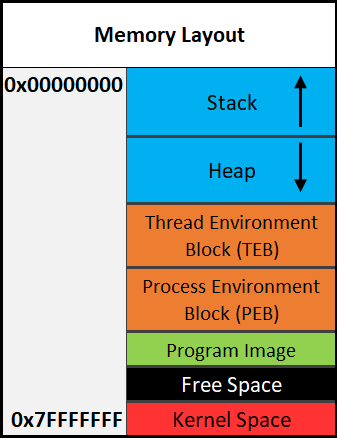
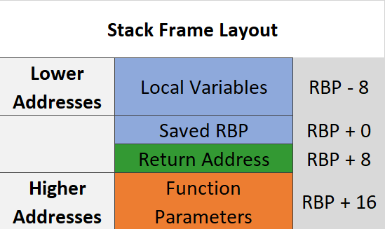
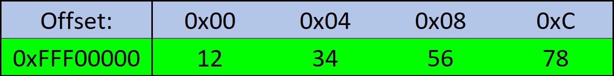

# 3.2 Memory Layout - Update Soon
The system's memory is organized in a specific way. This is done to make sure everything has a place to reside in.

## Assembly Segments
There are different segments/sections in which data or code is stored.
* **.data** - Contains global and static variables. This segment is a fixed size.
* **.bss** - Contains variables that are not explicitly initialized to any value. These variables are often zeroed out when the program starts.
* **.text** - Contains the code of the program (don't blame me for the name, I didn't make it).  
The start of the program code is declared with "global _start".

## Overview of Memory Sections
* **Stack** - Area in memory that can be used quickly for static data allocation. Imagine the stack with low addresses at the top and high address at the bottom. This is identical to a normal numerical list. Be warned, you will sometimes see the stack represented the other way around. Data is read and written as "last-in-first-out" (LIFO). The LIFO structure of the stack is often represented with a stack of plates. You can't simply take out the third plate from the top, you have to take off one plate at a time to get to it. You can only access the piece of data that's on the top of the stack, so to access other data you need to move what's on top out of the way. When I said that the stack holds static data I'm referring to data that has a known length such as an integer. The size of an integer is defined at compile-time, the size is typically 4 bytes, so we can throw that on the stack. Unless a maximum length is specified, user input should be stored on the heap because the data has a variable size. *However*, the address/location of the input will probably be stored on the stack for future reference. When you put data on top of the stack you **push** it onto the stack. **When data is pushed onto the stack, the stack grows towards lower memory addresses.** When you remove a piece of data off the top of the stack you **pop** it off the stack. There are two registers that are used to keep track of the stack. The **stack pointer (RSP/ESP/SP)** is used to keep track of the top of the stack and the **base pointer (RBP/EBP/BP)** is used to keep track of the base/bottom of the stack.
* **Heap** - Similar to the stack but used for dynamic allocation and it's a little slower to access. The heap is typically used for data that is more dynamic (changing or unpredictable). Things such as structures and user input might be stored on the heap. If the size of the data isn't known at compile-time, it's usually stored on the heap. **When you add data to the heap it grows towards higher addresses.**
* **Program Image** - This is the program loaded into memory. On Windows, this is typically a **Portable Executable (PE)**.
* **DLL** - **Dynamic Link Library (DLL)**. Libraries that can be used by programs.
> Don't worry too much about the TEB and PEB for now.
* **TEB** - The **Thread Environment Block (TEB)** stores information about the currently running thread(s).
* **PEB** - The **Process Environment Block (PEB)** stores information about the process and the loaded modules. One piece of information the PEB contains is "BeingDebugged" which can be used to determine if the current process is being debugged.  
PEB Structure Layout: [https://docs.microsoft.com/en-us/windows/win32/api/winternl/ns-winternl-peb](https://docs.microsoft.com/en-us/windows/win32/api/winternl/ns-winternl-peb)

Here is a general overview of how memory is laid out in Windows. **This is extremely simplified.**
<p align="center">
  
</p>

## Stack Frames
Stack frames are basically chunks of data for functions. This data includes local variables, the saved base pointer, the return address of the caller, and function parameters. Consider the following example:
```c
int Square(int x){
    return x*x;
}
int main(){
    int num = 5;
    Square(5);
}
```
In this example, the `main()` function is called first. When `main()` is called, a stack frame is created for it. This stack frame includes the local variable `num`, the saved (previous) base pointer, the return address, and the parameters passed to it (in this case there are no parameters passed to main). Remember, the base pointer points to the base/bottom of the stack. The base pointer is saved so when `Square()` returns it can be restored to what it was before the function call. This ensures that the stack stays organized and doesn't get all wonky. The return address is the address of the instruction after the instruction that called the function. That may sound confusing, hopefully, this can clear it up:
```asm
mov RAX, 15 ;RAX = 15
call func   ;Instruction that calls func. Same as func();
mov RBX, 23 ;RBX = 23. This is the saved return address for the call on the previous line.
```
I know that this can be a bit confusing but it really is quite simple in how it works. It just may not be intuitive at first. It's simply telling the computer where to go (what instruction to execute) when the function returns. You don't want it to execute the instruction that called the function because that will cause an infinite loop. This is why the next instruction is used as the return address instead.  
Here is the layout of a stack frame:
<p align="center">
  
</p>
Note the location of everything. This will be helpful in the future.

> If this lesson was confusing, read through [3.3 Instructions](3.3%20Instructions.md) then re-read this lesson. I apologize for this but there really isn't a good order to teach this stuff in since it all goes together.

## Endianness
> A is 0x41, B is 0x42, etc.

There's a bit of a debate on how data should be stored. Should you store ABCD as 0x41424344 or 0x44434241?
* Big Endian - The **most** significant byte is stored first. This would be 0x41424344 from the example. 
* Little Endian - The **least** significant byte is stored first. This would be 0x44434241 from the example.

Here are some recourses to learn more:  
* https://www.youtube.com/watch?v=seZLUbgbB7Y
* https://www.youtube.com/watch?v=NcaiHcBvDR4

## Data Storage
Data is stored in memory. Memory can be access byte by byte. This is quite a simple concept, but you need to understand it. Take a look at the following example:
<p align="center">
  
</p>
If we were going to refer to the data 12345678 we would say that it's stored at 0xFFF00000. However, this isn't entirely true. It's actually stored at 0xFFF00000 to 0xFFF00010. I just want to make sure that you understand that data is stored byte-by-byte.

* 12 is at 0xFFF00004
* 34 is at 0xFFF00008
* 56 is at 0xFFF0000C
* 78 is at 0xFFF00010

Again, this is quite a simple concept but you need to be sure that you understand it.

## RBP & RSP on x64
On x64, it's common to see RBP used in a non-traditional way. Sometimes only RSP is used to point to data on the stack such as local variables and function parameters, and RBP is used for general data (similar to RAX). This will be discussed in further detail later.

[<- Previous Lesson](3.1%20Registers.md)  
[Next Lesson ->](3.3%20Instructions.md)  

[Chapter Home](3.0%20Assembly.md)  
