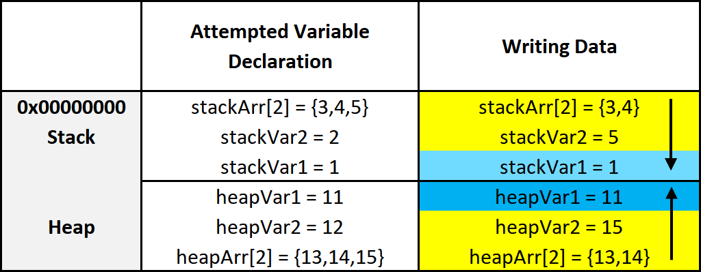

# 3.2 Memory Layout - Update Soon
The system's memory is organized in a specific way. This is done to make sure everything has a place to reside in.

## Assembly Segments
There are different segments/sections in which data or code is stored. They are laid out in the following order:  
* **Stack** - Holds non-static local variables. Discussed more in-depth soon.
* **Heap** - Contains *dynamically* allocated data that can be uninitialized at first.
* **.data** - Contains global and static data initialized to a *non-zero value*.
* **.bss** - Contains global and static data that is *uninitialized or initialized to zero*.
* **.text** - Contains the code of the program (don't blame me for the name, I didn't make it).

## Overview of Memory Sections

Here is a general overview of how memory is laid out in Windows. **This is extremely simplified.**
<p align="center">
  
</p>

### Important:
The diagram above shows the direction variables (and any named data, even structures) are put into or taken out of memory. The actual data is put into memory differently. This is why stack diagrams vary so much. You'll often see stack diagrams with the stack and heap growing towards each other or high memory addresses at the top. *I will explain more later*. The diagram I'm showing is the most relevant for reverse engineering. Low addresses being at the top is also the most realistic depiction.

## Each Section Explained:
* **Stack** - Area in memory that can be used quickly for static data allocation. Imagine the stack with low addresses at the top and high addresses at the bottom. This is identical to a normal numerical list. Data is read and written as "last-in-first-out" (LIFO). The LIFO structure of the stack is often represented with a stack of plates. You can't simply take out the third plate from the top, you have to take off one plate at a time to get to it. You can only access the piece of data that's on the top of the stack, so to access other data you need to move what's on top out of the way. When I said that the stack holds static data I'm referring to data that has a known length such as an integer. The size of an integer is defined at compile-time, the size is typically 4 bytes, so we can throw that on the stack. Unless a maximum length is specified, user input should be stored on the heap because the data has a variable size. *However*, the address/location of the input will probably be stored on the stack for future reference. When you put data on top of the stack you **push** it onto the stack. **When data is pushed onto the stack, the stack grows up, towards lower memory addresses.** When you remove a piece of data off the top of the stack you **pop** it off the stack. **When data is popped off the stack, the stack shrinks down, towards higher addresses.** That all may seem odd, but remember, it's like a normal numerical list where 1, the lower number, is at the top. 10, the higher number, is at the bottom. Two registers are used to keep track of the stack. The **stack pointer (RSP/ESP/SP)** is used to keep track of the top of the stack and the **base pointer (RBP/EBP/BP)** is used to keep track of the base/bottom of the stack. This means that when data is pushed onto the stack, the stack pointer is increased since the stack grew towards higher addresses. The base pointer has no reason to change when we push or pop something to/from the stack. We'll talk about both the stack pointer and base pointer more as time goes on.

> Be warned, you will sometimes see the stack represented the other way around, but the way I'm teaching it is how you'll see it in the real world.

* **Heap** - Similar to the stack but used for dynamic allocation and it's a little slower to access. The heap is typically used for data that is dynamic (changing or unpredictable). Things such as structures and user input might be stored on the heap. If the size of the data isn't known at compile-time, it's usually stored on the heap. **When you add data to the heap it grows towards higher addresses.**
* **Program Image** - This is the program/executable loaded into memory. On Windows, this is typically a **Portable Executable (PE)**.

> Don't worry too much about the TEB and PEB for now. This is just a brief introduction to them.
* **TEB** - The **Thread Environment Block (TEB)** stores information about the currently running thread(s).
* **PEB** - The **Process Environment Block (PEB)** stores information about the process and the loaded modules. One piece of information the PEB contains is "BeingDebugged" which can be used to determine if the current process is being debugged.  
PEB Structure Layout: [https://docs.microsoft.com/en-us/windows/win32/api/winternl/ns-winternl-peb](https://docs.microsoft.com/en-us/windows/win32/api/winternl/ns-winternl-peb)

Here's a quick example diagram of the stack and heap with some data on them.
<p align="center">
  
</p>

In the diagram above, `stackVar1` was created before `stackVar2`, likewise for the heap variables.

## Stack Frames
Stack frames are chunks of data for functions. This data includes local variables, the saved base pointer, the return address of the caller, and function parameters. Consider the following example:
```c
int Square(int x){
    return x*x;
}
int main(){
    int num = 5;
    Square(5);
}
```
In this example, the `main()` function is called first. When `main()` is called, a stack frame is created for it. The stack frame for `main()`, before the function call to `Square()`, includes the local variable `num` and the parameters passed to it (in this case there are no parameters passed to main). When `main()` calls `Square()` the base pointer (RBP) and the return address are both saved. Remember, the base pointer points to the base/bottom of the stack. The base pointer is saved because when a function is called, the base pointer is updated to point to the base of that function's stack. Once the function returns, the base pointer is restored so it points to the base of the caller's stack frame. The return address is saved so once the function returns, the program knows where to resume execution. The return address is the next instruction after the function call. So in this case the return address is the end of the `main()` function. That may sound confusing, hopefully, this can clear it up:
```asm
mov RAX, 15 ;RAX = 15
call func   ;Call func. Same as func();
mov RBX, 23 ;RBX = 23. This line is saved as the return address for the function call.
```
I know that this can be a bit confusing but it is quite simple in how it works. It just may not be intuitive at first. It's simply telling the computer where to go (what instruction to execute) when the function returns. You don't want it to execute the instruction that called the function because that will cause an infinite loop. This is why the next instruction is used as the return address instead. So in the above example, RAX is set to 15, then the function called `func` is called. Once it returns it's going to start executing at the return address which is the line that contains `mov RBX, 23`.

Here is the layout of a stack frame:
<p align="center">
  
</p>
Note the location of everything. This will be helpful in the future.

> If this lesson was confusing, read through [3.3 Instructions](3.3%20Instructions.md) then re-read this lesson. I apologize for this but there isn't a good order to teach this stuff in since it all goes together.

## Endianness

Given the value of 0xDEADBEEF, how should it be stored in memory? This has been debated for a while and still strikes arguments today. At first, it may seem intuitive to store it as it is, but when you think of it from a computer's perspective it's not so straightforward. Because of this, there are two ways computers can store data in memory - big-endian and little-endian.
* Big Endian - The **most** significant byte (far left) is stored first. This would be 0xDEADBEEF from the example.
* Little Endian - The **least** significant byte (far right) is stored first. This would be 0xEFBEADDE from the example.

Here are some recourses to learn more:  
* https://www.youtube.com/watch?v=seZLUbgbB7Y
* https://www.youtube.com/watch?v=NcaiHcBvDR4

## Data Storage
As promised, I'll explain how data is written into memory. It's slightly different than how space is allocated for data. As a quick recap, space is allocated for variables from bottom to top, or higher addresses to lower addresses. Data is put into this allocated space very simply. It's just like writing English: left to right, top to bottom. The first piece of data is at the lowest address. Data positions are referenced based on how far away they are from the address of the first byte of data, known as the **base address**  (or just the address), of the variable.

For example, let's say we have some data, 12345678. Just to push the point, let's also say each number is 2 bytes. With this information, 1 is at offset 0x0, 2 is at offset 0x2, 3 is at offset 0x4, 4 is at offset 0x6, and so on.

Again, this is quite a simple concept but you need to be sure that you understand it.

Another way to say all of this is that data is put into its allocated space in the opposite direction that the space for variables is allocated.

<p align="center">
  
</p>

This diagram illustrates two things. First, how data is put into its allocated space. Second, a side effect of how data is put into its allocated memory. I'll break down the diagram. On the left are the variables being created. On the right are the results of those variable creations. I'll just focus on the stack, for now, the heap can be figured out from there.

* On the left three variables are given values. The first variable, as previously explained, is put on the bottom. The next variable is put on top of that, and the next on top of that.
* After allocating the space for the variables, data is put into those variables. It's all pretty simple but something interesting is going on with the array. Notice how it only allocated an array of 2 elements, but it was given 3. Because data is written from lower address to higher or left to right and top to bottom, it overwrites the data of the variable below it. So instead of `stackVar2` being 2, it's overwritten by the 5 that's supposed to be in `stackArr[2]`.

Hopefully that all makes sense. Here's a quick recap:

Variables are allocated on the stack one on top of the other like a stack of trays. This means they're put on the stack from higher addresses to lower addresses.

Data is put into the variables from left to right, top to bottom. That is, from lower to higher addresses.

It's a simple concept, don't over-complicate it just because I've given a long explanation. It's vital you understand it, which is why I've taken so much time to explain this concept. It's because of these concepts that there are so many depictions of memory out there that go in different directions.

## RBP & RSP on x64
On x64, it's common to see RBP used in a non-traditional way. Sometimes only RSP is used to point to data on the stack such as local variables and function parameters, and RBP is used for general data (similar to RAX). This will be discussed in further detail later.

[<- Previous Lesson](3.1%20Registers.md)  
[Next Lesson ->](3.3%20Instructions.md)  

[Chapter Home](3.0%20Assembly.md)  