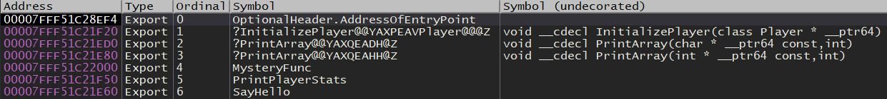

# 6.03 Exports
Let's start reversing this DLL. Because we want to implement this DLL into our own program, we don't care too much about what's going on internally. What we care about is what exported functions are available to us, what do they do, and what do we need to do to call them. To call a function we need to be sure that we get the function type and parameters correct.

## Finding Exports
Let's take a look at the DLL's exports. I will show you two tools we can use to do this. The first tool is DUMPBIN. This comes with Visual Studio. DUMPBIN is available in the developer command prompt. Open the dev prompt then navigate to the directory of the DLL. To show the exports for a DLL use the command `dumpbin DLL.dll /EXPORTS`.

This is what you will see:

<p>
  
</p>

We can also use x64dbg. First, load the DLL into x64dbg. Once loaded, go to the "Symbols' tab. Keep pressing the run button until you see DLL.dll show up in the "Modules" column.

Here are the exports in x64dbg:

<p>
  
</p>

Not all of the functions shown above are exports. Be sure to pay attention to whether a function is exported or imported. You can see if a function is exported or imported in the second column.

There are many other tools to find function exports. Another popular way is with a tool called "Dependency Walker".


## Function Overloading, Mangling, and Decoration
What's with the random characters in some of the function names, such as ?PrintArray@@YAXQEAD@Z? This name mangling is done for function overloading. Function overloading allows for multiple functions with the same name to have different implementations. For example, you might want to have a function for addition. You'll probably want the ability to add integers, floats, or even string representations of them. To provide different functionality with one function name, such as `Add()`, you can use function overloading. Here is another example:

```c++
float Add(float x, float y){
  return x+y;
}

int Add(int x, int y){
  return x+y;
}

int main(){
  Add(2,3); //Calls Add(int x, int y);
  Add(4.5, 1.2); //Calls Add(float x, float y);
}
```

> When a function's name is mangled, it's called a  decorated function.

In the DLL we'll be reversing we can see two functions called "PrintArray" that are both decorated. This means that they are overloads and one takes different parameters than the other. They most likely do the same thing, although this isn't a guarantee. 

Decorated functions are *not* a feature in C. If a function isn't decorated that means it's going to be a C function. A function can manually be defined as a C function by prefixing the function declaration with `extern "C"`. Because of this, we can assume that some of the other functions such as `SayHello` are prefixed with `extern "C"`.

A function that doesn't have any overloads does *not* need to be defined as a C function. As you can see, `InitializePlayer` is decorated but there are no other functions with the same name, so it's never overwritten. One nice thing about decorated functions is that we will know their return type and parameters. We can see that `InitializePlayer` takes a pointer to a class called "`Player`" and it returns void. 

You may also notice "__cdecl". This is short for C Declaration which is a calling convention. They are prefixed with this because they are C functions, although they don't have to follow the cdecl calling convention.

[<- Previous Lesson](6.02%20DLLBasics.md)  
[Next Lesson ->](6.04%20SayHello.md)  

[Chapter Home](6.00%20DLL.md)  
