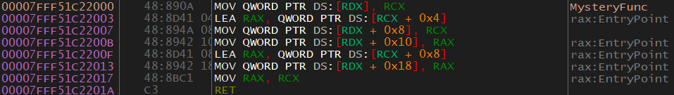

# 6.08 MysteryFunc
I decided to introduce you to reversing with some DLL exports because we have the function names. Unfortunately, this isn't always the case. This function, even though it's quite small, will be a little preview of what to expect very soon.

Here is the disassembly of `MysteryFunc`:

<p>
  
</p>

I'm going to tackle this function slightly differently, just to show you that there are different ways to do things. First, we'll look at what exactly is going on and figure out the parameters. Then we'll interpret that information. 

This function seems to take two parameters because both RCX and RDX are used.

* `MOV QWORD PTR DS:[RDX], RCX` - RDX looks like a pointer into some data structure because of how it's being used. What I mean by this is that it's being accessed with offsets (Ex. +0x8) which is an indicator of some sort of data structure. This could be an array or a class (or something similar). This code will move RCX (first parameter) into [RDX] (address pointed to by the second parameter). RDX is a pointer of some kind.
* `LEA RAX, QWORD PTR DS:[RCX + 0x4]` - Loads the address of `RCX + 0x4` into RAX.
* `MOV QWORD PTR DS:[RDX + 0x8], RCX` - Move RCX (the first parameter) into RDX + 0x8.
* `MOV QWORD PTR DS:[RDX + 0x10], RAX` - Move RAX (the address of RCX + 0x4) into RDX + 0x10.
* `LEA RAX, QWORD PTR DS:[RCX + 0x8]` - Load the address of RCX + 0x8 into RAX.
* `MOV QWORD PTR DS:[RDX + 0x18], RAX` - Move RAX into RDX + 0x18.
* `MOV RAX, RCX` - RCX is moved into RAX as a return value. This tells us that this function returns a pointer to some structure. Note that this structure is also the second parameter. Oddly, it's returning an unmodified parameter, but that's how it is. 
  
Let's break it down. It appears that the function takes two parameters that are both some kind of data structures (struct, class, array, etc). As a quick note, when data structures are passed it's just their starting/base address that gets passed. From that address, the function accesses elements in the structure with offsets. Maybe this function is some form of initialization/setup code for a data structure. It appears that the overall purpose of this function is to copy stuff from one data structure into another data structure. One thing that I find interesting is that the data structures are not aligned. An example of what I mean is something like `x[0] = x[1]`. That means this isn't just a plain data structure copy function. Maybe it's adding extra data, or maybe they are two different structures. Let's reanalyze the code with our new-found knowledge. 

Another thing to look at is the offsets. RDX is access with offsets +8, +10, and +18. This indicates that each piece of data, with a possible exception of the last one, is the same size. RCX is accessed with +4, and +8. This also hints at the same situation. **The important thing here is to realize that RDX offsets are at intervals of 8, and RCX elements are at offsets of +4.**

* `MOV QWORD PTR DS:[RDX], RCX` - The address of the RCX data structure is put into the first element of the RDX data structure.
* `LEA RAX, QWORD PTR DS:[RCX + 0x4]` - The address of the second parameter in the RCX data structure is moved into RAX. RAX is being used as a middle-man to move addresses into the structures. This is done because something like `MOV [RDX + 0x8], [RCX + 0x4]` is not a valid instruction. That's just how Assembly works.
* `MOV QWORD PTR DS:[RDX + 0x8], RCX` - RCX is moved into the second element in the RDX data structure. I know this is the second element and not the third (as it would be if there were 3, 4-byte integer elements at offsets +0x0, +0x4 +0x8) because the first element in RDX is an address (specifically the address of the RCX data structure). This DLL is 64-bit, so the address is most likely 64 bits (8 bytes). So the first element is a 64-bit (8 bytes) address, not 4 bytes.
* `MOV QWORD PTR DS:[RDX + 0x10], RAX` - Move RAX (the address of the second element in the RCX data structure) into the third element in the RDX data structure.
* `LEA RAX, QWORD PTR DS:[RCX + 0x8]` - Move the address of the third element in the RCX data structure into RAX.
* `MOV QWORD PTR DS:[RDX + 0x18], RAX` - Move RAX (the address of the third element in the RCX data structure) into the fourth element of the RDX data structure.
* `MOV RAX, RCX` - Return the first parameter, which is the address of the RCX data structure. Once again, this is odd because RCX contains an unmodified parameter (so why return it?), and RCX was already copied into the RDX data structure. It may seem pointless, weird, or even redundant but you'll be surprised what you see when reversing.

So basically the RDX structure contains pointers to the elements, in order, of the RCX data structure. It also contains a pointer to the structure itself, which is redundant because the first element is the same as the address of the structure. But that's just how it is. The data structures are not aligned, so they are different structures. We also know that the RCX data structure has offsets of +4 and RDX has offsets of +8.

Hey, now it's starting to make sense! We still aren't sure what the data structures are. They could be classes, arrays, or any other data structure type. In reality, the difference is between a class and an array is very small. Let's take a look at some pseudo-code of what we can guess is going on.

If they are both classes:

```c++
class OldClass{
public:
    int x, y, z;
};
class NewClass {
public:
    int* addrOfOldClass;
    int *x, *y, *z;
};

void* CopyClass(OldClass* oldClass, NewClass* newClass) {
    newClass->addrOfOldClass = oldClass;
    newClass->x = (int*)&oldClass->x;
    newClass->y = (int*)&oldClass->y;
    newClass->z = (int*)&oldClass->z;
    return oldClass;
}

int main() {
    OldClass oldClass;
    oldClass.x = 10;
    oldClass.y = 20;
    oldClass.z = 30;

    NewClass newClass;
    CopyClass(&oldClass, &newClass);
}
```

If they are both arrays:

```c++
void* CopyArray(int oldArray[], void* newArray[]) {
    newArray[0] = &oldArray; //addr of oldArray
    newArray[1] = &oldArray[0]; //addr of oldArray[0]
    newArray[2] = &oldArray[1];
    newArray[3] = &oldArray[2];
    return &oldArray;
}

int main() {
    int myArray[3] = { 1,2,3 };
    void* addrArray[4]; //array of pointers
    CopyArray(myArray, addrArray);
}
```

Hopefully, now you understand what it is the `MysteryFunc` is doing.

## Here is the actual code of the function:
> You can ignore `extern "C" __declspec(dllexport)`. `__declspec(dllexport)` which defines the function as a DLL export and `extern "C"` which prevents name mangling. I obtained the source code because I wrote the DLL we're reversing.

```c++
class Player {
public:
    int score;
    float health;
    std::string name;
};

void* MysteryFunc(Player* player, int* arr[]) {
    arr[0] = (int*)player;
    arr[1] = (int*)&player->score;
    arr[2] = (int*)&player->health;
    arr[3] = (int*)&player->name;
    return player;
}
```

As you can see, we pretty much nailed it. The actual code reveals that both a class and an array were used. More specifically, the contents of a class are copied into an array. In this case, there isn't any way we could have known if the parameters were classes or arrays with just static analysis. On a low-level, both structures and arrays are accessed the same way. We knew that the parameters were data structures, but we couldn't know what kind. The only way we could have been more precise is by debugging a program that uses the DLL and analyzing how it uses `MysteryFunc()`. 

I enjoyed this lesson. This sort of problem/puzzle solving is why I enjoy reversing so much. This was a simple example, I assure you that we will look at more complex examples soon.

[<- Previous Lesson](6.07%20PrintPlayerStats.md)  
[Next Lesson ->](6.09%20ImplementingPlayer.md)  

[Chapter Home](6.00%20DLL.md)