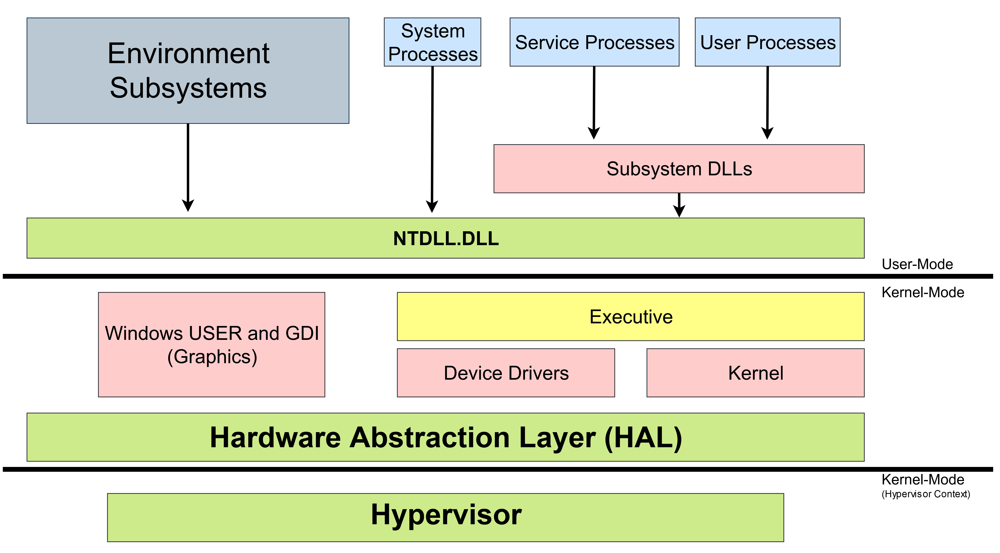

# 7.3 Architecture
As already discussed, Windows separates kernel-mode and user-mode. However, Windows doesn't stop there. Various other components are separated and organized in a structure-like way. Windows is built with an object-oriented design, although, this is more apparent with  kernel-mode components because mostly everything there runs together. User-mode is not as object-oriented because most of the components don't work together.

It's important to point out that this object-oriented design pertains to the components, not necessarily the underlying code. While the system components work in an object-oriented way, the OS is written in C which is not an *object-oriented programming* (OOP) language. This becomes apparent when looking at low-level structures (C doesn't have classes). Structures in C don't have any sort of OOP functionality. In C there is no structure inheritance, methods, constructors, etc.

### Service vs Process
It's important to know the difference between a service and a process. A Windows service is just a daemon. A daemon is a program that runs in the background and is controlled by the OS, not the user. A process is similar, except it can be started or interacted with by a user. An example of a process is the logon process. An example of a service is the user manager. You interact with the logon process by entering a username and password. You don't interact with the user manager, it manages users in the background. Defining something as a process or service can be tricky and there are often processes that you would think are services, and services you would think are processes.

## Layout
Here is a simplified view of the Windows architecture layout:  

  

First off, notice the kernel-mode and user-mode separation. Also notice that the hypervisor is being shown in its own kernel-mode context, note however, the hypervisor runs in normal kernel-mode.

### User-Mode:
* **Environment Subsystems** - This is essentially what users and programmers are presented. Think of it as the underlying implementation of the overall environment/personality presented to the OS users and programmers. There are three main subsystems which are Windows, POSIX, and OS/2. OS/2 was last used in Windows 2000. POSIX was replaced by the *Subsystem for Unix-based Applications* (SUA) which was then replaced with *Windows Subsystem for Linux* (WSL).
* **User Processes** - Conventional processes started and ran in user-mode.
* **Service Processes** - These host Windows services such as the *Task Scheduler*. These usually run along with the OS, meaning it doesn't matter if a user is logged in or not. If the OS is running, they're running.
* **System Processes** - Fixed/hard-coded processes (not services).

You may notice that service and user processes run "through" subsystem DLLs. This is because user-mode applications don't call the native Windows OS services directly. Instead they go through subsystem DLLs. The role of these DLLs is to translate documented and public function calls into the internal (typically undocumented) native system functions. Most of these functions/services are implemented in NTDLL.dll.

### Kernel-Mode:
* **Windows USER and GDI (Graphics)** - Low-level GUI functions.
* **Executive** - The executive contains the main OS services such as memory management, process management, I/O, and much more.
* **Device Drivers** - Drivers such as hardware, network, and I/O drivers.
* **Kernel** - The Windows kernel contains the low-level OS code. The kernel manages multiprocessor synchronization, interrupt scheduling and dispatching, exception dispatching, and more.
* **HAL** - The *Hardware Abstraction Layer* (HAL) separates the hardware from the rest of the system. It hides differences in hardware from the OS.
* **Hypervisor** - The hypervisor is essentially self-contained. It even includes things such as its own memory manager.

## Core Windows Files
(Credit to "Windows Internals" for this diagram).

Name|Components
---|---
ntoskrnl.exe|Executive and Kernel.
hal.dll|HAL
win32k.sys|Kernel-mode GDI support.
hvix64.exe (Intel), hvax64.exe (AMD)|Hypervisor
.sys files in \SystemRoot\System32\Drivers|Core driver files.
ntdll.dll|Internal support functions to executive functions.
kernel32.dll, advapi32.dll, user32.dll, gdi32.dll|Core subsystem DLLs.

[<- Previous Lesson](7.2%20Privileges.md)  
[Next Lesson ->](7.3%20Architecture.md)  

[Chapter Home](7.0%20Windows.md) 

##### Sources:
Yosifovich, Pavel, et al. *Windows Internals. System Architecture, Processes, Threads, Memory Management, and More.* Microsoft Press., 2017.